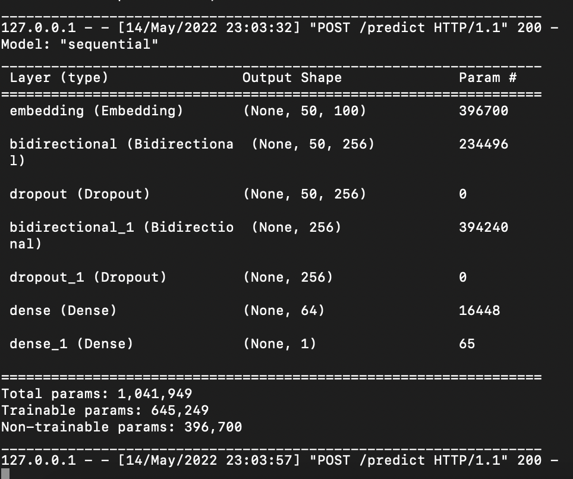
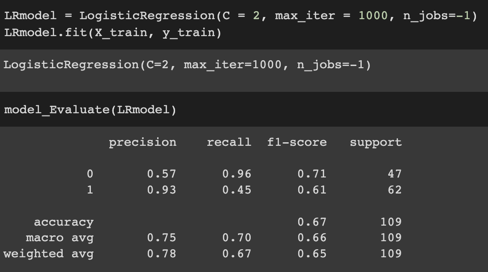

## Bonus 3 work by Devansh Modi (016114189)

### Collect tweets data from twitter via twitter api or Selenium/Beautiful Soup, you can collect data based on your own application/needs.

I used BeautifulSoup, Python, and Twint to scrape data from Twitter 

Here are my dataframe columns:

- 0 -  emergency_ or not				
- 1 - created_at
- 2 - screen_name
- 3 - tweet_text

 

 

### Perform tweets Preprocessing

- I perform multiple steps of preprocessing for the data.
- My preprocessing steps included:
  - There are some unnecessary columns. The task is to classify the tweets for emergency case. 
    So, I have dropped some extra columns.
  - Content Cleaning using Stemming - it does refers to the process of reducing words 
    into thier base form. In case of the problem for classification, it is very important 
    operation as we need to focus on the meaning of particular word. For instance words: Jumping, 
    Jumped, Jumper all can reduce to the stem word Jump. Below we have used the base of english 
    stopwords and stemming algorithm from nltk library.
  - Remove HTTP links. These links don't add emergency classification relevance in my model.

 

### Data Split

 

 

### Text Length

### Perform Tweets Classification - Emergency or Not

### To train the classification model, you need to perform data labeling (at least 200 tweets each category)
Try multiple models or multiple configurations (one of them must be neural network based model). Evaluate the accuracy of your solutions, put your result comparison figure/graph in document.

 

 

 

### Select the best model, deploy it to the real application and get the realtime tweet 
classification. You can have one application oriented code (e.g., python server, web app, mobile app) that collects tweets in realtime and return the classification results. Document your efforts to optimize the realtime data mining pipeline and your results/screenshots of your application.

I have built a Python Server using Flask. The code is available in `rest-api` folder.

### Neural Network with Sequential Forward Feed

In my neural network model, I experiment with multiple configurations such as:

- Using LSTM for better classification over sequences.
- RELU Activation Function
- Different Optimizers - Final is Adam.

 

 

 

### Logistic Regression

 

 

Accuracy is only 67% with the logistic regression model. 

Based on the comparison, the neural network model is better due to higher accuracy.

## Conclusions

- I used the Emergency or Not Emergency application for classifying tweets. I also labeled the tweets manually.
- Using my scraping code, I was able to get 543 tweets for each category to achieve a balanced training dataset.
- One improvement for my model might be to use a more complex embedding layer like GloVe 300d.
- I achieved 80% accuracy with the neural network, but overall I did not achieve higher accuracy 
  because of under-represented dataset.
